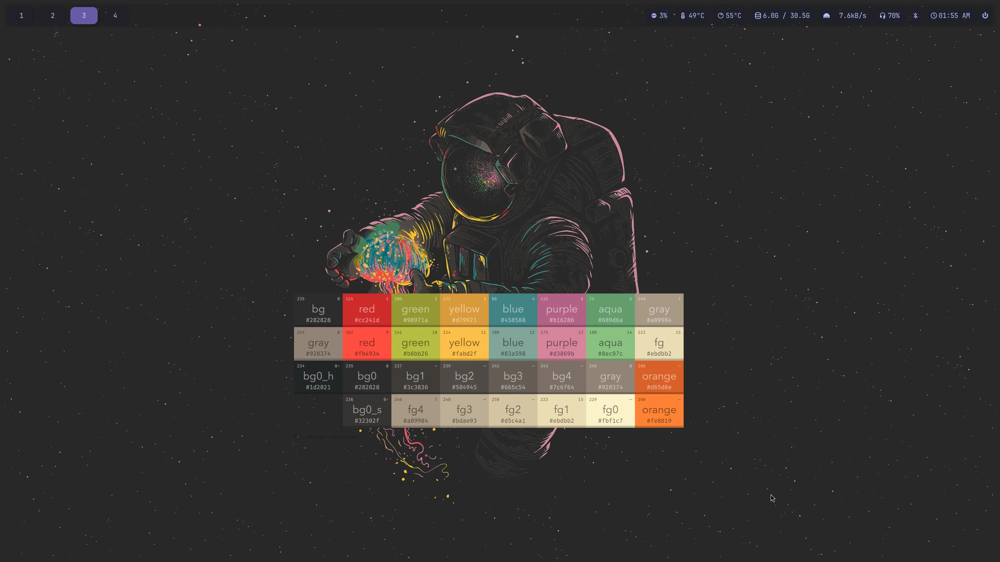
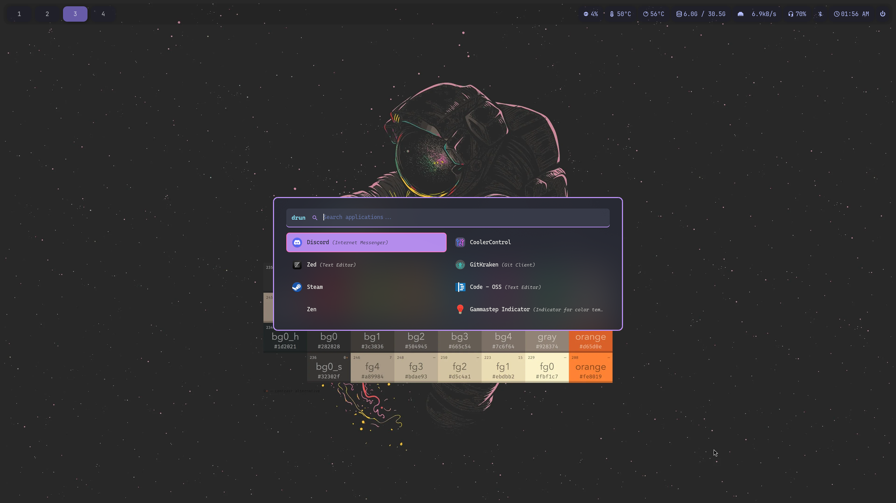
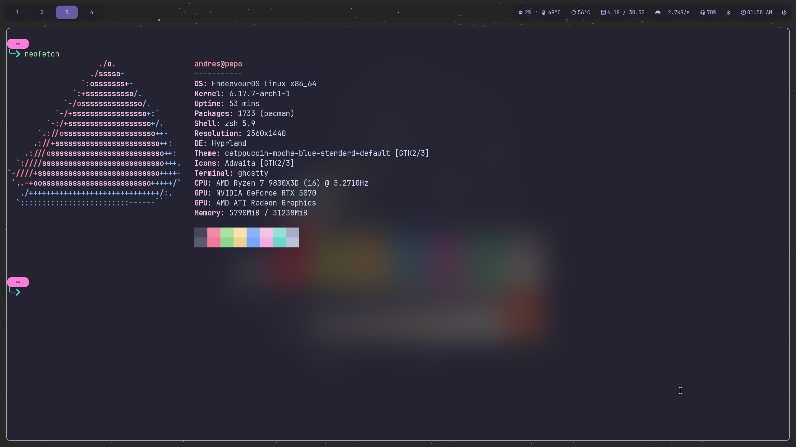
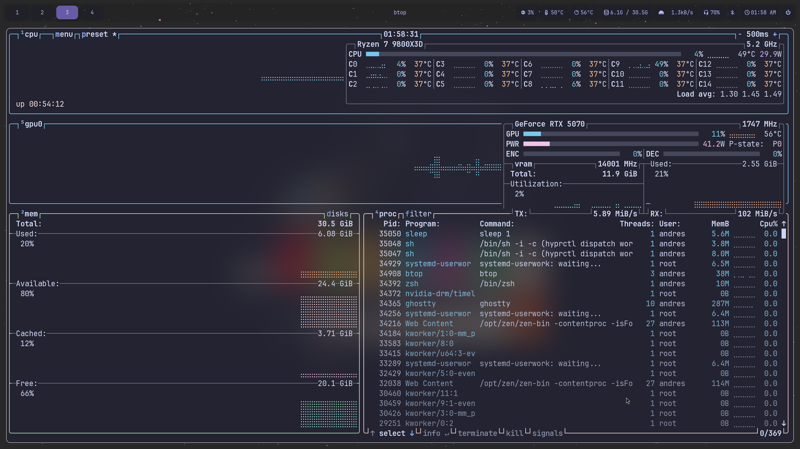
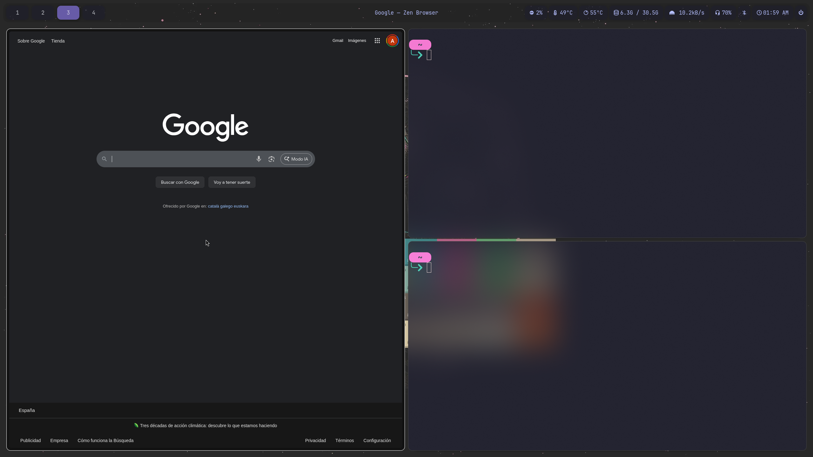
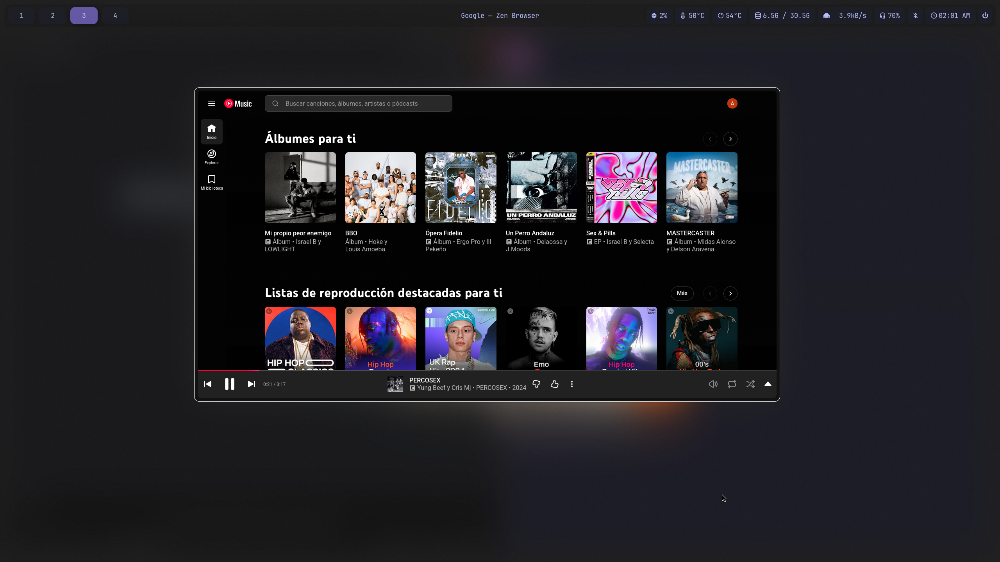

# 🎨 Dotfiles


[](https://opensource.org/licenses/MIT)


A cross-platform dotfiles repository with automated setup using [dotbot](https://github.com/anishathalye/dotbot). Supports both **Arch Linux** and **macOS** with OS-specific configurations.

## 📸 Screenshots

### Hyprland (Arch Linux)

**Clean Desktop**

*Hyprland with Waybar, custom blur effects, and wallpaper*

**Rofi Application Launcher**

*Application launcher with custom Dracula-inspired theme*

**Terminal Setup**

*Ghostty terminal with neofetch showing system info*

**System Monitor**

*btop system monitor in Ghostty terminal*

**Tiled Workspace**

*Multiple windows tiled showing the power of Hyprland's window management*

**YouTube Music Scratchpad**

*Dropdown YouTube Music scratchpad (SUPER+M)*

## 🎯 Philosophy

This dotfiles repository is built on a few core principles:

- **Cross-platform by design:** Single repository managing configurations across multiple operating systems, with OS-aware automation that adapts to your environment
- **Automation-first:** One command installation that handles everything—no manual symlink creation or configuration copying
- **Modular organization:** Configurations are organized by function and application, making it easy to understand, maintain, and extend
- **Version-controlled evolution:** All configuration changes are tracked in git, enabling experimentation with the safety of rollback
- **Symlink-based system:** Changes reflect immediately without manual copying—edit once, apply everywhere
- **Modern tooling:** Preference for modern, fast, and developer-friendly tools that enhance productivity
- **Developer-focused:** Optimized for software development workflows with sensible defaults and powerful shortcuts

## 🏗️ Architecture

The repository uses a modular, OS-aware architecture that automatically configures your system based on the detected operating system.

### Core Structure

```
dotfiles/
├── config/          # Application configurations (organized by app)
├── shell/           # Shell environment (aliases, functions, exports)
├── modules/         # Git submodules (dotbot installation framework)
├── bin/             # Custom executables and scripts
├── os/              # OS-specific configurations and setup scripts
├── language/        # Programming language-specific configurations
├── data/            # Assets (screenshots, wallpapers, themes)
├── .arch-conf.yml   # Arch Linux dotbot configuration
├── .mac-conf.yml    # macOS dotbot configuration
└── install          # Automated installation script
```

### How It Works

1. **Installation:** Run `./install` to automatically detect your OS and create symlinks
2. **Symlink Creation:** Dotbot creates symlinks from the repository to your home directory
3. **Shell Integration:** The installer sets up `$DOTFILES` environment variable and sources shell configurations
4. **Immediate Effect:** Changes to dotfiles are immediately reflected in your system

## 🚀 Quick Start

### Installation

```bash
# Clone repository
git clone https://github.com/andres-ortizl/dot-files.git ~/code/dotfiles
cd ~/code/dotfiles

# Run installer (auto-detects OS)
./install

# Or specify config manually
./install -c .arch-conf.yml  # For Arch Linux
./install -c .mac-conf.yml   # For macOS
```

The installer will:
1. Initialize git submodules (dotbot)
2. Detect your operating system
3. Create symlinks based on OS-specific config
4. Set up shell environment
5. Configure `$DOTFILES` environment variable

### What Gets Installed

**Common (Both OS):**
- Shell configurations (Zsh with Zim framework)
- Git configuration
- Modern CLI tools (Starship prompt, Bat, lsd)
- Terminal emulator (Ghostty)
- Code editor (Zed)

**Arch Linux Specific:**
- Hyprland window manager (Wayland compositor)
- Waybar status bar
- Rofi application launcher
- Dunst notifications
- Wlogout power menu
- Zen Browser
- Nautilus file manager
- swww wallpaper manager

**macOS Specific:**
- Karabiner keyboard customization
- iTerm2 configuration
- Amethyst window manager
- GitKraken themes

## 📁 Directory Structure

### `config/`
Application-specific configurations organized by tool. Each application has its own subdirectory with all related configuration files. Examples include:
- `hypr/` - Hyprland window manager (modular config files)
- `waybar/` - Status bar with custom modules
- `rofi/` - Application launcher themes
- `ghostty/` - Terminal emulator configuration
- `zed/` - Code editor settings
- `git/` - Git aliases and configuration
- `starship/` - Cross-shell prompt configuration
- And many more...

### `shell/`
Shell environment configuration that's automatically sourced:
- `main.sh` - Entry point that sources all other files
- `aliases.sh` - Command aliases (git shortcuts, modern tool replacements)
- `exports.sh` - Environment variables and PATH configuration
- `functions.sh` - Custom shell functions for common tasks
- `functions/` - Executable shell scripts added to PATH

**Key features:**
- Git workflow shortcuts (`gl`, `gaa`, `gco`, `gs`, etc.)
- Modern command replacements (`ls` → `lsd`, `cat` → `bat`, `vim` → `nvim`)
- Custom functions for Docker, Kubernetes, AWS, and more
- Automatic `$DOTFILES` environment variable

### `os/`
OS-specific configurations and setup scripts:
- `archlinux/` - Arch Linux specific setup and hooks
- `mac/` - macOS specific configurations
- `homeserver/` - Server-specific configurations

### `language/`
Programming language-specific configurations for Go, Java, Python, Rust, etc.

### `modules/`
Git submodules for external dependencies (currently just dotbot).

### `bin/`
Custom executables and scripts that should be in `$PATH`.

### `data/`
Non-configuration files like screenshots, wallpapers, and themes.

## ⚙️ Configuration Philosophy

### Modular Configuration
Complex configurations are broken into logical modules. For example, Hyprland configuration is split across multiple files:
- `monitor.conf` - Display setup
- `keybinding.conf` - All keybindings
- `decoration.conf` - Visual effects
- `windowrule.conf` - Per-application rules
- And more...

This makes it easy to understand, modify, and maintain large configurations.

### OS-Aware Configuration
The dotbot configuration files (`.arch-conf.yml`, `.mac-conf.yml`) define OS-specific symlink mappings. Some applications have OS-specific configs:
- Shell RC files (`.zshrc_arch` vs `.zshrc_mac`)
- Application configs (different paths for macOS vs Linux)
- Tool-specific settings that vary by platform

### Shell Integration
The installer automatically adds to your shell RC files:
```bash
export DOTFILES=/path/to/dotfiles
source $DOTFILES/shell/main.sh
```

This loads all aliases, functions, and exports automatically on every shell session.

## 🎯 Current Setup

### Arch Linux (Hyprland)
A modern Wayland-based desktop environment:
- **Window Manager:** Hyprland (Wayland compositor)
- **Status Bar:** Waybar with custom modules
- **Terminal:** Ghostty
- **Shell:** Zsh with Zim framework
- **Editor:** Zed, Neovim
- **Launcher:** Rofi
- **Browser:** Zen Browser
- **File Manager:** Nautilus
- **Notifications:** Dunst
- **Lock Screen:** Hyprlock
- **Wallpaper:** swww
- **Theme:** Dracula-inspired with custom blur/opacity effects

### macOS
A consistent development environment:
- **Window Manager:** Amethyst
- **Terminal:** Ghostty, iTerm2
- **Shell:** Zsh with Zim framework
- **Editor:** Zed, Neovim
- **Keyboard:** Karabiner-Elements for customization
- **Theme:** Consistent with Linux setup

## 🔧 Customization

### Adding New Applications

1. Add configuration files to `config/your-app/`
2. Add symlink mapping to the appropriate dotbot config file (`.arch-conf.yml` or `.mac-conf.yml`):
   ```yaml
   - link:
       ~/.config/your-app: config/your-app/**
   ```
3. Run `./install` to create symlinks

### Modifying Shell Configuration

Edit files in `shell/` directory:
- `aliases.sh` - Add new aliases
- `functions.sh` - Add new functions
- `exports.sh` - Add environment variables

Changes take effect immediately (no reinstall needed) after reloading your shell.

### OS-Specific Customization

Some apps have OS-specific configs. Check the dotbot configuration files to see how OS-specific paths are handled. You can add new OS-specific configurations by:
1. Creating OS-specific config files (e.g., `config_linux.json` vs `config_mac.json`)
2. Mapping them appropriately in the dotbot config files

## 📦 Dependencies

### Arch Linux
```bash
# Core tools
paru -S zsh git neovim lsd bat starship

# Hyprland setup
paru -S hyprland-git waybar-git rofi dunst \
        wl-clipboard grim slurp hyprlock swww

# Applications
paru -S ghostty zed zen-browser btop

# Fonts
paru -S ttf-cascadia-code-nerd nerd-fonts-jetbrains-mono
```

### macOS
```bash
# Using Homebrew
brew install zsh git neovim lsd bat starship
brew install ghostty zed
brew install --cask amethyst karabiner-elements
```

## 🛠️ Management

### Update Dotfiles
```bash
cd ~/code/dotfiles
git pull
./install  # Recreate symlinks if needed
```

### Update Submodules
```bash
git submodule update --remote --merge
```

### Check Symlink Status
```bash
# See where configs are linked
ls -la ~/.config/ | grep " -> "
```

### Uninstall
```bash
# Dotbot clean (removes dead symlinks)
./install -c .arch-conf.yml --only clean
```

## 🧩 Notable Features

### Hyprland Configuration
Modular structure with separate files for different aspects of configuration, making it easy to understand and modify window management behavior.

### Shell Enhancements
- Modern CLI tool replacements (lsd, bat, etc.)
- Comprehensive git workflow shortcuts
- Custom functions for Docker, Kubernetes, AWS workflows
- Fuzzy finder integration (fzf) for history, processes, and more

### Custom Scripts
- `config/hypr/scripts/` - Hyprland utility scripts (screenshots, scratchpads)
- `config/waybar/scripts/` - Custom Waybar modules
- `config/keybindings-helper/` - TUI keybinding viewer

## 🐛 Troubleshooting

### Symlinks Not Created
```bash
# Check dotbot output
./install -v  # Verbose mode

# Manually verify symlinks
ls -la ~/.config/your-app
```

### Shell Changes Not Applied
```bash
# Reload shell
source ~/.zshrc

# Or verify $DOTFILES is set
echo $DOTFILES
```

### OS Detection Issues
```bash
# Check detected OS
uname -s  # Darwin (macOS) or Linux

# Force specific config
./install -c .arch-conf.yml
```

### Submodule Problems
```bash
# Reset submodules
git submodule deinit -f .
git submodule update --init --recursive
```

## 📚 Documentation

- [Dotbot](https://github.com/anishathalye/dotbot) - Installation framework
- [Hyprland Wiki](https://wiki.hyprland.org/) - Wayland compositor
- [Waybar Wiki](https://github.com/Alexays/Waybar/wiki) - Status bar
- [Zim Framework](https://github.com/zimfw/zimfw) - Zsh plugin manager

## 🔄 Continuous Integration

GitHub Actions automatically test the installation process on every push to ensure:
- Dotbot configuration is valid
- Symlinks can be created successfully
- No broken paths or references

## 🤝 Contributing

Feel free to:
- Fork and customize for your own use
- Submit issues for bugs
- Suggest improvements

## 📝 License

MIT License - See [LICENSE](LICENSE) file for details.

## 📫 Contact

For questions or suggestions: andres.ortiz.xyz@gmail.com

---

⭐ If these dotfiles helped you, consider starring the repository!
