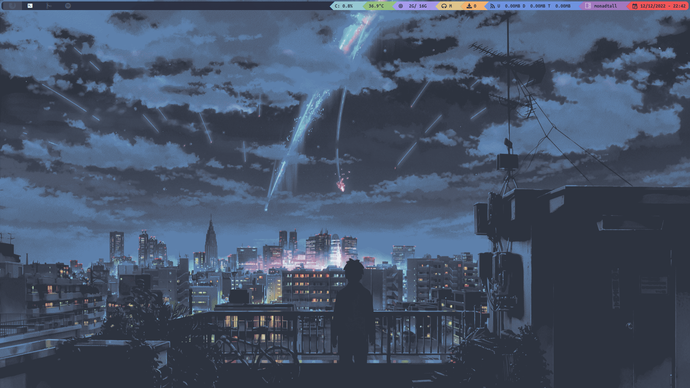
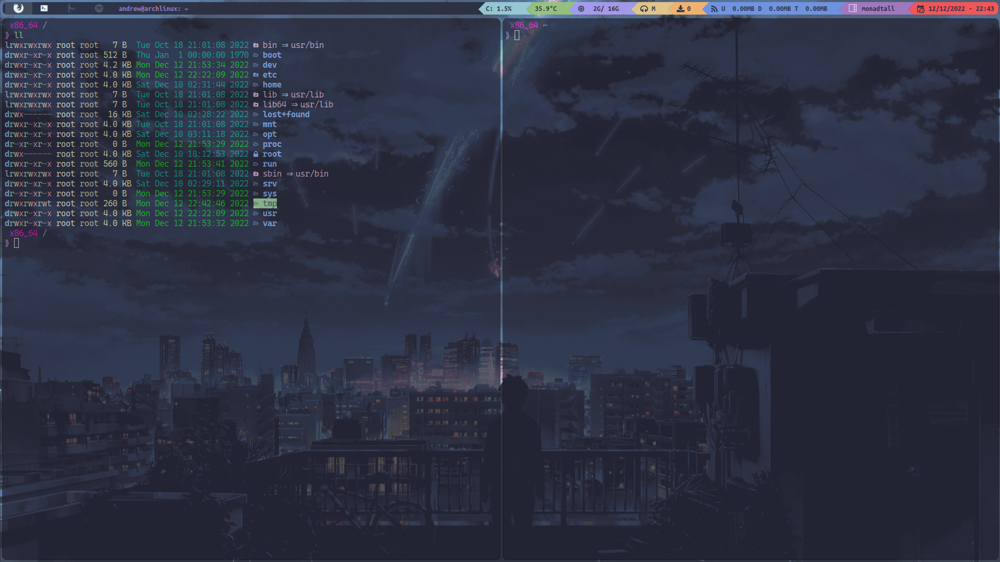
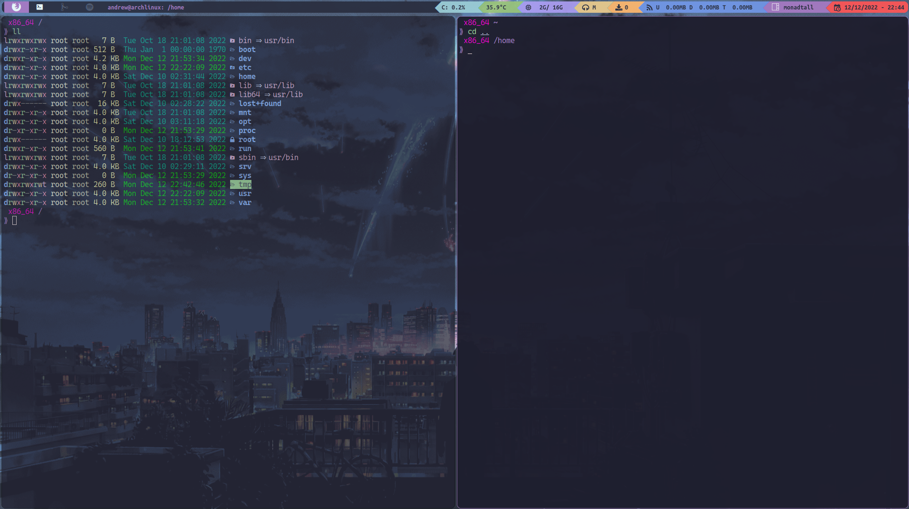
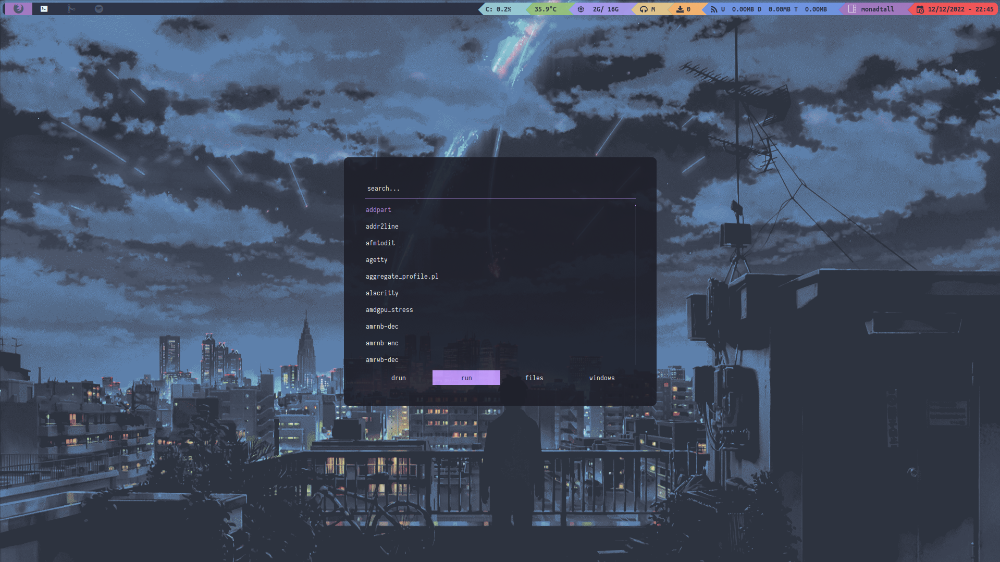
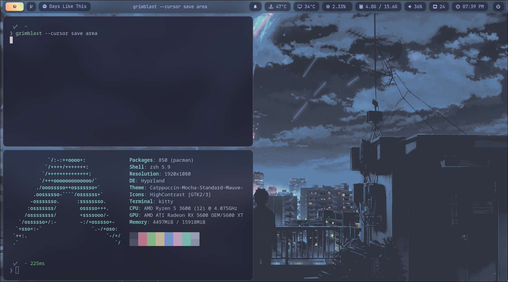
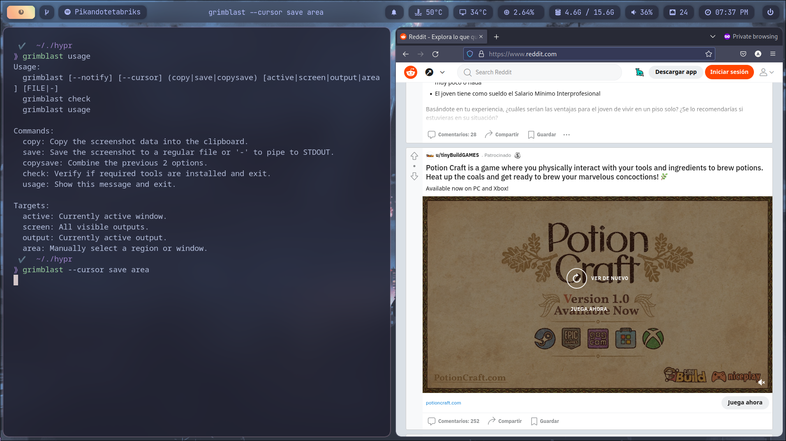
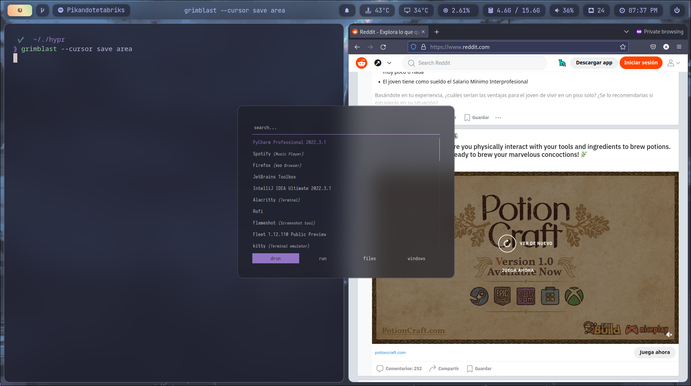

# dotfile


 [](https://opensource.org/licenses/MIT)

It's a collection of my dotfiles for Arch & Mac OS X.

## Showcase for Arch ( Qtile ) :






- Compositor : [picom](https://github.com/yshui/picom)
- Window Manager : [Qtile](http://www.qtile.org/)
- Window Switcher : [rofi](https://github.com/davatorium/rofi)
- Terminal Theme for Alacritty : [Catppuccin (Mocha Flavour)](https://github.com/catppuccin/alacritty)
- Terminal Font : [Caskaydia Cove](https://github.com/ryanoasis/nerd-fonts/releases/download/v2.2.2/CascadiaCode.zip)
- Firefox : [Dracula](https://draculatheme.com/firefox)

## Showcase for Arch ( Hyprland ) :





- Window Manager : [Hyprland](https://github.com/hyprwm/Hyprland)
- Bar : [Waybar](https://github.com/Alexays/Waybar)
- Notification Daemon : [Dunst](https://github.com/dunst-project/dunst)
- Wallpaper loader : [swww](https://github.com/Horus645/swww)
- Window Switcher : [rofi](https://github.com/davatorium/rofi)
- Terminal Theme for Alacritty : [Catppuccin (Mocha Flavour)](https://github.com/catppuccin/alacritty)
- Terminal Font : [Caskaydia Cove](https://github.com/ryanoasis/nerd-fonts/releases/download/v2.2.2/CascadiaCode.zip)
- Firefox : [Dracula](https://draculatheme.com/firefox)

### Installation Qtile dots (Arch Based) :

I've a bunch of packages installed but you can install the bare minimum to get started.
In case I'm missing something you can check the full list in the [packages](./config/package.list) file.

```bash
paru -S nerd-fonts-cascadia-code nerd-fonts-ubuntu picom qtile-extras-git qtile-git rofi alacritty python2-iwscan xcb-util-cursor
```

Clone this repo:

```bash
git clone https://github.com/andres-ortizl/dot-files.git andrew-dotfiles
```

This will overwrite your current configuration files for this applications.
Copy configuration files to `~/.config`:

```bash
cd andrew-dotfiles/config && cp -r alacritty/ picom/ qtile/ rofi/ tmux.conf ~/.config/
```

# Configuration

### Qtile autostart

You may need to change here the paths to the apps you want to autostart and its locations.
Do it on `config/qtile/autostart.sh`

### Qtile themes

The themes are stored in `config/qtile/themes/`. They are nothing but simple json file.
The default and only theme right now is `dracula.json` but you can add or edit this file.
You can change the default theme editing the file `config/qtile/themes/config.json`

### Qtile Extra configuration

- edit default keybindings in `config/qtile/settings/keys.py`
- edit widgets in `config/qtile/settings/widgets.py`
- edit workspaces in `config/qtile/settings/groups.py`

Some of the keybindings are:

- Terminal : `mod + enter`
- Rofi : `mod + space`
- Firefox : `mod + b`
- Reload qtile : `mod + ctrl + r`

### Rofi

Rofi is a window switcher, run dialog, ssh-launcher started as a clone of simpleswitcher.

- edit styles in `config/rofi/config.rasi`
- Theme : Dracula

You can find extra themes here : [Rofi Themes](https://github.com/adi1090x/rofi)
Take into account that Rofi is being launch using a specific command in the Qtile keys config file, so you may need to
change it.

### Picom

Picom is a lightweight compositor for X11. It's used to add transparency to windows.
You can find the configuration file in `config/picom/picom.conf`

### Redshift

Redshift is a program that adjusts the color temperature of your screen according to your surroundings. This may help
your eyes hurt less if you are working in front of the screen at night.
The default keybinding to toggle redshift is `mod + r`
You can reset it using the keybinding `mod + shift + r`

### Problems

In case the network widget is not working use `ip addr` to find your interface, then :

```python
#Open the file ../qtile/settings/widget.py :

#Here you should find a list called *primary_widget*
#Find the line :

    widget.Net(**base(bg='color3'), interface='wlan0',
               mouse_callbacks={'Button1': lazy.spawn('iwgtk')}),

#Change the interface argument to your modem name, in my case 'wlan0'
```

Remember all of the keybinding will not work unless if finds all the apps I use :
To install all of the apps I use :

I also have some scripts for minor things like screenshot and toggling the mic.
You can find them in `os/archilinux/qtile/scripts.`

### Installation Hypr (Arch Based) :

```bash
paru -S hyprland-git 
waybar-hyprland-git cava kitty rofi xdg-desktop-portal-hyprland-git grim slurp jq dunst wl-clipboard swaylock-effects-git btop swww polkit-kde-agent 
nerd-fonts-jetbrains-mono playerctl socat inotify-tools-git
```

Again, if i'm missing something you can check the full list in the [packages](./config/package.list) file.

Clone this repo:

```bash
git clone https://github.com/andres-ortizl/dot-files.git andrew-dotfiles
```

This will overwrite your current configuration files for this applications.
Copy configuration files to `~/.config`:

```bash
cd andrew-dotfiles/config && cp -r hypr/ rofi/ swaylock/ wallpapers/ dunst/ ~/.config/
```

### Hyprland Configuration

You can find the configuration files for Hyprland in `config/hypr/`. The main configuration file is hyprland.conf.
The default configuration is for two monitors, 4 workspaces, but you can change it to your liking. You can configure
here keybindings, workspaces, effects, etc. More info in the [Hyprland Wiki](https://wiki.hyprland.org/)

### Waybar Configuration

Waybar is a highly customizable Wayland bar for Sway and Wlroots based compositors. You can find the configuration file
in `config/waybar/config`. You can customize the bar for each monitor. You can also change the default theme in
the file `config/waybar/style.css`

If you want to customize your temperature sensor, you may want to take a look to your folder `/sys/class/hwmon/`, maybe
your sensor is different than the one that I have. Wiki here : [Waybar Wiki](https://github.com/Alexays/Waybar/wiki)

### Gammastep

Redsfhit like program for wayland so you can control the color temperature of your screen.

### Cursor

https://github.com/catppuccin/cursorsgs

### Contact

If you have any questions or suggestions, feel free to contact me at andres.ortiz.xyz@gmail.com