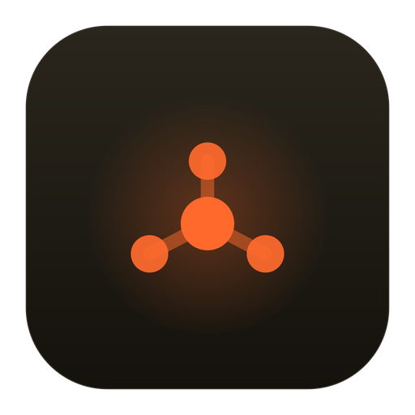
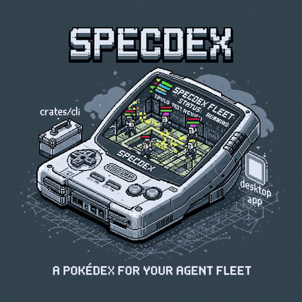

<p align="center">
  
</p>

# specdex

**A Pokédex for your agent fleet.** You describe a feature; a team of agents plans, implements, reviews, and ships it autonomously — and specdex renders every concurrent run as a living "minion" you can watch at a glance.

You rarely touch a terminal command. Your two touchpoints are: **kick off [`/specdex`](#1--you--describe-a-feature)** with a feature description, and **open the [desktop app](#3--the-companion-app--watch-the-swarm)** to watch the swarm. Everything between — the event recording, the state, the orchestration — runs itself.

<p align="center">
  
</p>

---

## How it actually works

Three actors, one loop:

```
   YOU                  THE /specdex LOOP                 THE COMPANION APP
describe a   ──▶   plan → build → review → ship → verify   ──▶   live fleet of minions
feature            (coder + reviewer agents, per worktree)       (one calm place to watch)
                          │
                          └── emits dex events ──▶ ~/.spec registry ◀── the app reads this
```

### 1 · You — describe a feature

```
/specdex  build a CSV export for the reports page
```

You iterate on the plan interactively until it's approved. Then you step back — the rest is autonomous, and you watch it in the app. (`/specdex` is an agent skill; the binaries here are the substrate it runs on.)

### 2 · The `/specdex` loop — the primary user of `dex`

The loop spins up a team of agents per spec — a **coder** (TDD: red → green, parallelizing independent chunks) and a **reviewer** (loops on findings until PASS) — each spec in its own worktree. As they work, they **emit `dex` events** at every milestone: phase changes, agent spawns, test results, review verdicts, the PR, CI gates.

> `dex` is the agents' instrument, not yours. The loop writes the event stream; you almost never type a `dex` command by hand (see the [CLI reference](#cli-reference) for when you do — mostly debugging).

The loop reads `dex config` to dispatch to the configured notifier / CI / review provider, so it names no vendor itself — *config* says which tool fills each role.

### 3 · The companion app — watch the swarm

The Tauri desktop app reads the registry and renders the fleet live (filesystem watcher → webview): a minion per running spec, carrying its lifecycle phase, a health state, and the 0–2 agents working on it. Per project, you see which runs are alive, which are stale, and which one is **blocked and needs you** — without tailing a single log.

There's also a **curator** that works across the whole `~/.spec` fleet (run via `/specdex curate`): it reads `note` events from every spec, clusters cross-spec patterns (recurring skill feedback, repeated env failures), and proposes concrete skill/config improvements — the signal an individual run can't see on its own.

## Why a substrate at all

The loop used to leave its state as prose in `logbook.md` files — not machine-readable, no liveness, no fleet view. specdex makes the state real:

- **Event-sourced.** Every run appends to a per-spec `events.jsonl`; state is always *derived*, never hand-set.
- **Vendor-agnostic.** The core names no tool — not Slack, not Greptile, not a specific CI. It records generic facts (`gate --provider review`); config says which tool fills each role.
- **One source of truth.** The same typed event vocabulary drives the loop, the desktop app, the notifications, and the audit trail.

## Components

| | What |
|---|---|
| **`/specdex`** (`skill/`) | the agent skill — the loop that plans, codes, reviews, ships, and emits events. **The primary writer.** |
| **specdex** (`apps/desktop`) | the [Tauri](https://tauri.app) desktop app — the live fleet of minions you watch. **The primary human surface.** |
| **`dex`** (`crates/cli`) | the data plane — records events, reads config, streams the fleet. The loop's instrument. |
| **`specdex-core`** (`crates/core`) | the event schema, registry scanner, state derivation, config/vault resolution, curator |

The registry lives at `~/.spec/<project>/<spec>/` — `events.jsonl` (source of truth) + a derived `state.json` (cheap per-spec snapshot).

## Install

```bash
cargo install --path crates/cli      # installs `dex` (the loop calls this)
cargo run -p specdex-desktop         # launches the desktop app
```

The `/specdex` skill itself lives in `skill/` (a draft agent skill); install it alongside your other Claude skills. Its reactor/hook skills are **external** (not bundled): `/pr` (ship), plus the configured `ci`/`pr_review` reactors (e.g. `/react-to-pipelines`, `/react-to-greptile`). `dex config validate` warns if any are missing.

## Configuration

specdex is config-driven and vendor-neutral. Each project declares its integrations in a committed `.dex.toml`; optional machine-wide defaults live in `~/.config/dex/config.toml` (merged `defaults ← vault ← project`).

```toml
# .dex.toml — at the repo root
[providers]
notifier  = "slack"          # slack | discord | none
ci        = "github-actions" # the CI provider
pr_review = "greptile"        # greptile | coderabbit | none

[[ports]]                     # services this project runs locally; a CLI declares none
service = "frontend"
base    = 5173
env     = "VITE_PORT"

[phases]
skip = ["verify"]             # optional: skip CI/bot-review for this project
```

```bash
dex config show          # merged effective config
dex config validate      # typed validation; warns on referenced skills not installed
dex config schema        # the machine-readable option space (for self-configuration)
```

## CLI reference

You won't type these in normal use — the loop emits them. They're here for debugging a run by hand or understanding what the loop records. The grammar is git-style: **one operation records one event; state is derived.** The target spec is ambient via `DEX_SPEC` (or `-s <project>/<name>`).

```bash
export DEX_SPEC=my-project/my-feature   # the spec id (also the registry path)

dex init --branch spec/my-feature --worktree /path/to/worktree
dex phase build
dex agent spawn coder --id ag1
dex test --passed 42 --failed 0
dex phase review
dex review --round 1 --verdict pass
dex pr --number 4012 --url https://github.com/org/repo/pull/4012
dex phase verify
dex gate --provider ci --result success
dex phase complete

dex ls          # the fleet, with derived health
dex watch       # stream the fleet as JSON, live on every change
dex notes --json # every note event across the fleet (the curator's input)
```

**Lifecycle.** Phases: `setup · plan · build · review · ship · verify · complete · accepted`. `block "<reason>"` / `unblock` is a flag layered on the current phase, not a phase. Derived health: `alive` · `idle` · `stale` (no heartbeat) · `needs-you` (blocked) · `done`.

## Architecture

A Cargo workspace, event-sourced end to end:

```
skill/        /specdex — the loop: plan → code → review → ship → verify (the writer)
crates/core   event schema (the contract) · ~/.spec scanner · state derivation · config · curator
crates/cli    `dex` — record events, config, ls/watch, ports alloc (the data plane)
apps/desktop  Tauri app — wraps core's fleet snapshot + a notify watcher → live webview
```

The event envelope is CloudEvents-flavored (`type`/`time`/`source`/`subject`/`data`); the `data` payload is the project's own typed vocabulary.

## Status

Early. The substrate, CLI, config, the `/specdex` loop, and a live desktop fleet view work. In progress: the spec-detail screen (per-run timeline + agent view), in-app config/signals screens, and the curator surface.
